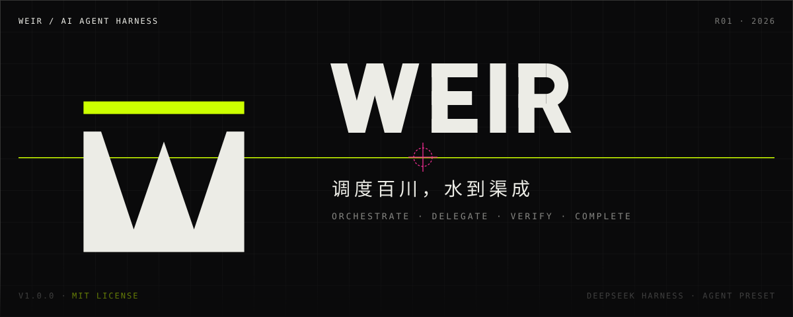
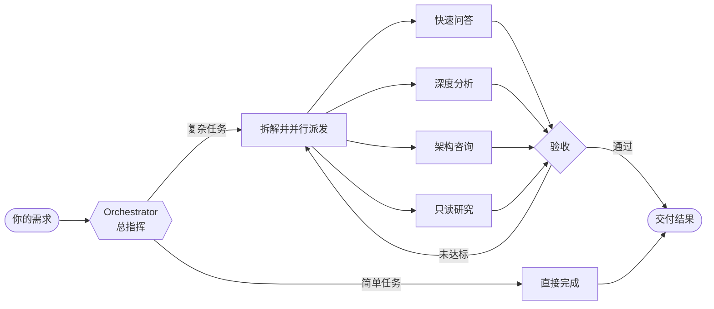

<p>
  
  
  
</p>

**Weir 是 DeepSeek Harness 的 agent 预设：把助手变成总指挥，拆任务、派子代理、盯进度，直到活干完。**

## 为什么用 Weir

| 常见痛点 | Weir 的做法 |
|---|---|
| 做到一半停下，等你催 | 清单没完成就自动续推；你一喊停，立刻停 |
| 什么活都用同一个模型硬扛 | 按任务类别分配模型，主模型不可用时按备选链降级 |
| 上下文一满就丢三落四 | 提前提醒整理记忆，逼近上限时自动压缩 |
| 改文件改歪、多处互相覆盖 | 锚点校验编辑、独立 worktree 车道、可选编辑锁 |
| 子代理重复踩同一个坑 | 会话黑板沉淀已验证的发现，不挖第二遍 |

## 工作方式



## 亮点

### 指挥调度
- **总指挥统筹**：简单的活直接干，复杂的活拆给子代理，能并行就并行，每个子任务都有交付标准和验收。
- **模型各司其职**：九种任务类别加三个只读研究代理，各自绑定模型链，设置页可视化配置、可单独停用。
- **后台委派**：耗时任务后台运行，完成只推一条简短通知；支持任务分组、续聊式子任务，重启不丢。
- **会话黑板**：子代理的发现写入共享黑板，经你裁决后可晋升为持久文档。→ [会话黑板](docs/features/blackboard.md)

### 工程执行
- **锚点编辑**：读取自带锚点，逐锚校验，任何一处对不上就整体拒绝；编辑以逐行着色 diff 呈现，更准也更省 token。
- **语义级代码理解**：接入 LSP 后，跳转定义、查找引用、跨文件重命名都由语言服务器给出真实答案；可一键安装缺失的语言服务器（13 种语言）。
- **Worktree 车道**：隔离的改动在独立分支与目录中进行，合并前由你确认。
- **编辑锁（实验）**：多会话改同一项目时，文件需先持有再编辑，可请求对方转交。→ [编辑锁](docs/features/edit-lock.md)

### 持续在线
- **不催不停**：异常自动退避重试，连续失败如实报告。
- **听懂意图**：说「深度工作」「仔细研究一下」即进入对应模式；开启语义分类后无需关键词。
- **离开屏幕也不误事**：需要审批、提问或长任务完成时发系统通知（正在看窗口时不打扰；对整个 profile 生效，可在设置页关闭）。

## 内置技能

意图命中时自动加载，也可手动调用。

| 技能 | 作用 |
|---|---|
| `deep-work` | 证据驱动的端到端完成，不以「看起来对了」为完成 |
| `research` | 并行检索代码、文档与网络，产出带引用的综述 |
| `review-work` | 完工把关：实际验证，再审目标覆盖、代码质量与安全 |
| `debugging` | 先复现、排序假设、用最低成本实验定位根因 |
| `git-master` | 原子提交、rebase、squash、bisect、历史考古 |
| `refactor` | 重构、清理与重组 |
| `programming` | Python / Rust / TypeScript / Go 的现代写法规范 |
| `remove-ai-slops` | 在回归测试保护下清除 AI 代码异味 |
| `work-with-pr` | PR 全流程：独立 worktree、证据化验证、可读的 PR 描述 |
| `remove-deadcode` | 验证后原子提交式删除死代码 |

Weir 会话只显示**已启用**的技能与 MCP server，由右侧栏 **Capabilities 面板**统一管理；能力集合可存为预设、导入导出，第三方技能支持检查更新（需你确认后发布）。→ [会话能力管理器](docs/features/session-capability-manager.md)、[Skill 分发](docs/features/skill-distribution.md)

## 快速开始

1. 安装 bundle：在 Harness 会话中通过 `plugin_manager` 的 `install_bundle` 装 `weir-harness`（从 npm registry 安装，无需克隆仓库），或 `dsh plugin --profile <profile> add weir-harness`；克隆了仓库的开发者改用 `plugins/weir-harness` 目录做 link 安装（随源码更新）。
2. 打开 Web GUI 预设选择器，选择 **Weir** 新建会话。开发或调试 DeepSeek Harness 本身时选 **Weir 创造模式**，额外带上运行时检查工具与开发技能。→ [预设打包](docs/features/preset-packaging.md)
3. 其他预设不受影响。Weir 只在自己的会话内生效，唯一例外是系统通知（作用于 profile 层）。

## 配置

全局设置中的 **Weir 设置页**可一站式调整：意图分类档位、各类别模型链、续推与退避上限、上下文压力阈值、锚点编辑开关、只读 shell 白名单等。多数改动即时生效，需重启的选项带「需重启」标记。→ [设置页](docs/features/settings-page.md)

## 技术概览

- **形态**：bundle 包 `plugins/weir-harness/`（发布到公共 npm registry，运行时零 npm 依赖），声明预设 `weir`。
- **运行时**：DeepSeek Harness（Electron 宿主），插件仅通过 `ctx` 使用宿主服务，不静态引用宿主包。
- **审计**：关键事件写入 `.weir/audit.jsonl`，不污染会话日志。
- **测试**：单元测试（node:test）、静态检查（tsc checkJs）、基于 mock LLM 的集成测试（`plugins/weir-test-harness/`，仅限开发）。

```
plugins/
├── weir-harness/        # 正式 bundle：预设、特性模块、技能
└── weir-test-harness/   # 开发专用集成测试装置
docs/
├── features/            # 特性细节文档
└── assets/              # 品牌与图像资产
```

## 了解更多

- 特性细节（行为、配置、设计、失败语义）：[docs/features/](docs/features/README.md)
- 版本更新记录：[CHANGELOG.md](CHANGELOG.md)
- 参与开发（纪律、环境、测试流程）：[AGENTS.md](AGENTS.md)
- 品牌资产：[docs/assets/brand/](docs/assets/brand/)

## 许可

[MIT](LICENSE)
